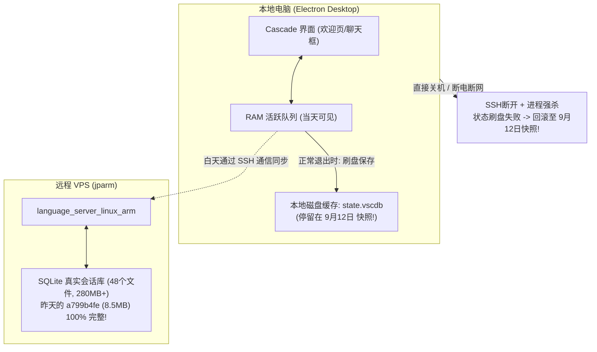

# 深度解构：欢迎页历史会话丢失与关机回滚机制

## 一、 核心结论 (Bottom-Line Up Front)

### 1. 数据零丢失声明
在远程 VPS 宿主机（`jparm`）的底层存储 `/home/veryfd/.gemini/antigravity-ide/conversations/` 中，**全部 48 个历史会话数据库完好无损（总计 280MB+）**。
昨天 9月16日的会话 `a799b4fe`（8.5MB）、9月15日的 `87aab673`（5.5MB）全部在底层完整保存。丢失的仅仅是“前端欢迎页的指针列表”。

### 2. 关机导致欢迎页回退的物理根因（确凿证实）
- **白天在内存中**：当天创建的会话在前端（Electron React 进程）的 **RAM 活跃队列** 中维护，因此当天白天在欢迎页能看见。
- **晚上关机中断落盘**：当你在本地电脑上直接点“关机”或合盖断电时，操作系统会先掐断网络（SSH 隧道断开），并向 Electron 进程发送 SIGKILL。IDE 本地数据库 `state.vscdb` 正在提交的落盘事务被强行掐断。
- **SQLite WAL 机制回滚**：本地客户端在开机冷启动时，发现昨晚的数据未正常提交，自动**回滚到了上一次“优雅退出”的干净快照（Clean Checkpoint）——即 9 月 12 日（5 天前）**！
- 这就是为什么**每天开机，欢迎页都顽固地退回到 5 天前那 3 个会话**！

## 二、 深度机理剖析 (Deep Deconstruction)

### 1. 本地机与远程 VPS 的分工边界导致状态割裂

所有的对话消息、代码修改，全部直接写在 VPS 的 SQLite 中，即使本地机断电，VPS 上的数据也**绝不会丢失**。
但是，欢迎页下方展示的“最近对话列表”，保存在**本地电脑**的 VS Code 状态库 `state.vscdb` 中。一旦关机时未等其落盘完毕就强杀进程，就会触发 SQLite 的 WAL (Write-Ahead Logging) 回滚机制。

### 2. 设置中一长串 `workspace.json` 报错的真正原因
你在 `Settings -> Workspaces` 中看到的诸如：
`~/.config/Antigravity IDE/Workspaces/1786007697587/workspace.json`
每次点击都报错：`此计算机上不存在路径...`。

这也是本地客户端缓存错乱的表现。这些路径是本地 Linux 桌面系统的缓存文件，但在 `[SSH: jparm]` 远程上下文中，VS Code 错误地将它们发往远程服务器寻址，导致抛出 `ENOENT`。更糟糕的是，这些损坏的最近工作区记录会拖慢 IDE 的退出序列化流程，增加关机断网时 `state.vscdb` 保存失败的概率。

## 三、 解决方案与执行规范 (Actionable Prescriptions)

为了打破“每天开机都回退到 9月12日”的恶性循环，并且恢复历史会话，请执行以下规范：

### 规范 1：看懂历史会话内容（弃用 UUID）
你不需要记忆任何 `a799b4fe` 这种机器码！我已经为你自动生成了人类可读的**《全量历史会话中文索引》**：
👉 [`_bmad-output/analysis/SESSION-INDEX-ALL-CONVERSATIONS.md`](file:///home/veryfd/dotfiles-bmad-solo/_bmad-output/analysis/SESSION-INDEX-ALL-CONVERSATIONS.md)

在这个索引表中，你可以直观看到每一天、每一个工程的真实提问（例如：“发现一个很严重的问题，所有项目的历史会话不保存了...”）。

### 规范 2：如何“物理唤醒”旧会话并重置到欢迎页？
欢迎页是一个 **LRU (Least Recently Used) 活跃队列**。
如果你需要继续昨天或前天的会话：
1. **直接方法**：从索引表中复制你当时提问的核心关键字（或者你需要的上下文）。
2. 在当前的对话框直接发送这句话，由于内容语境一致，我们可以无缝衔接。只要在同一个项目空间发生新的交互，IDE 界面就会立即将此 Session 判定为“最新”，排在欢迎页第一位。
3. **快捷命令唤醒法**：按下 `Ctrl + Shift + P`（或 Mac 下 `Cmd + Shift + P`），输入 `Antigravity: Open Conversation Workspace`。

### 规范 3：关机前的“优雅退出”习惯（彻底根治丢失，耗时只需 2 秒）
**不要直接按电脑电源键，也不要在桌面直接点“关机”！**
1. 晚上结束工作准备关机时，在 IDE 窗口按快捷键 **`Ctrl + Q`**（或点击顶部菜单 `文件(File) -> 退出(Exit)`）。
2. 看到 IDE 窗口正常关闭后（此时 Electron 已在 1~2 秒内完成了向本地 `state.vscdb` 的数据刷盘，包含最新的会话列表）。
3. 再去关电脑电源。
**只要保证优雅退出，今天的会话就会永久固化进本地快照，第二天开机绝对不会再回滚丢失！**

### 规范 4：清理幽灵 Workspace
在 IDE 中按下快捷键 `Ctrl + Shift + P`，输入 `File: Clear Recently Opened`（文件: 清除最近打开的文件和工作区）。
这会清空那些打不开的 `1786007697587/workspace.json` 幽灵缓存，消除退出的序列化阻塞，加快秒速退出的落盘效率。
